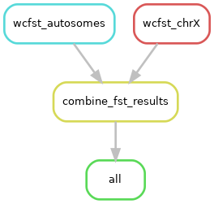

### fst_calculation

This directory contains a Snakemake workflow to compute Weir and Cockerham $F_{ST}$ using 1KGP Genomes high-coverage phased VCFs ([NYGC 30X coverage](https://www.internationalgenome.org/data-portal/data-collection/1000genomes_30x)) at fine-mapped MAGE v1.1 eQTL loci.

For each focal continental group (`AFR`, `EUR`, `SAS`, `EAS`, `AMR`), the workflow compares that group against the complement background (all remaining groups combined) to compute a continental group $F_{ST}$ against the background global allele frequency. 

#### Workflow summary

The pipeline performs the following steps:

1. Read metadata and define focal continental groups and chromosomes (`chr1`-`chr22`, `chrX`)
2. Subset each chromosome-level 1KGP VCF to fine-mapped variant IDs for that chromosome
3. Compute `wcFst` for each focal group versus background on each chromosome
4. Concatenate chromosome-level `wcFst` outputs into one table per focal group

#### Required configuration

Runtime configuration is stored in `config.yaml`. The workflow expects the following keys:

1. `focal_metadata`: Tab-delimited metadata table containing sample labels and continental groups. Only focal samples (i.e., one library per set of biological replicates) should be included. 
2. `finemapped_variants`: Tabix-indexed fine-mapped variant file used to identify loci per chromosome
3. `tgp_vcf_dir`: Directory containing per-chromosome 1KGP phased VCFs with filenames matching the patterns used in `workflow/Snakefile`

Note that both the `finemapped_variants` and the VCFs in `tgp_vcf_dir` should use the same variant ID format (e.g., `1:19254:G:C`) to ensure proper subsetting and matching. Absence of this information can cause multiple variants to be retained due to multiallelic sites.

The metadata file is expected to provide:

1. `internal_libraryID` values in column 4 (used as sample IDs)
2. `continentalGroup` labels in column 6 (used to define focal vs background sets)

#### Directory contents

```text
fst_calculation/                              
├── config.yaml                               # Input paths for metadata, fine-mapped variants, and VCF directory
├── README.md                                 # Workflow documentation
├── smk7_fst.yaml                             # Conda environment for running Snakemake and wcFst
└── workflow/                                 
	├── Snakefile                             # Main workflow rules for per-chromosome and combined FST outputs
	├── bin/                                  
	    └── compute_fst.sh                    # Subset variants and compute wcFst for each focal group
```

#### Primary outputs

The `all` rule expects one output file per focal continental group:

1. `results/wcFst.AFR.tsv`
2. `results/wcFst.EUR.tsv`
3. `results/wcFst.SAS.tsv`
4. `results/wcFst.EAS.tsv`
5. `results/wcFst.AMR.tsv`

Each output table contains:

1. `seqid`
2. `pos`
3. `targetaf`
4. `backgroundaf`
5. `wcFst`

Intermediate chromosome VCFs capturing finemapped variants are written as `results/finemapped_loci.{chromosome}.vcf.gz`.

#### Running the workflow

Create the Snakemake environment from this directory:

```bash
mamba env create -f smk7_fst.yaml
conda activate smk7_fst
```

Run the full workflow:

```bash
snakemake --configfile config.yaml -j 16 --use-conda -p # Adjust -j for parallel execution
snakemake --configfile config.yaml --profile /path/to/profile/ -p # Use --profile to specify the Snakemake profile for cluster execution
```

The profile in `/path/to/profile/` supplies shared execution settings for this project.

#### Rulegraph

