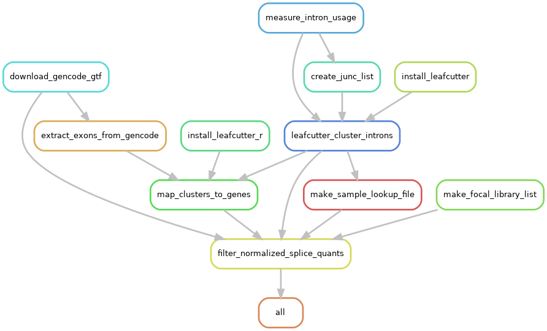

### 02_intron_usage

This directory contains the Snakemake workflow used to quantify intron excision with `regtools` and `leafcutter` from STAR-aligned RNA-seq BAM files. The workflow aggregates junction usage across all libraries, clusters introns with `leafcutter`, maps clusters to genes using GENCODE v38 exons, and produces filtered and normalized intron usage phenotypes for downstream sQTL analyses.


#### Workflow summary

The pipeline performs the following steps:

1. Extract splice junctions from each aligned BAM with `regtools junctions extract`
2. Build a manifest of `.junc` files and run `leafcutter_cluster_regtools.py`
3. Download the GENCODE v38 annotation and extract exon intervals
4. Install the required `leafcutter` dependencies and map intron clusters to genes
5. Generate sample-lookup and sample-retention files from the metadata tables
6. Filter low-expression and low-complexity clusters and prepare normalized phenotype tables

#### Required configuration

Runtime configuration is stored in `config.yaml`. The workflow expects the following keys:

1. `focal_metadata`: Tab-delimited metadata table for the subset of libraries to retain in the final phenotype matrix
2. `total_metadata`: Tab-delimited metadata table for all libraries used during junction discovery and clustering
3. `bam_dir`: Directory containing coordinate-sorted BAM files and BAM indexes named as `{internal_libraryID}.bam` and `{internal_libraryID}.bam.bai`
4. `gencode_url`: URL for the GENCODE GTF used to derive exon coordinates

#### Directory contents

Generated directories such as `results/` and `logs/` are omitted below.

```
02_intron_usage/
├── config.yaml                               # Input paths and URL
├── README.md                                 # This file
├── rg.png                                    # Rendered Snakemake rule graph
├── snakemake_env.yaml                        # Conda environment for running Snakemake
└── workflow/
	├── Snakefile                               # Main workflow definition
	├── bin/
	│   ├── extract_exons_from_gtf.py           # Extract exon intervals from GTF
	│   ├── filter_quants.py                    # Filter and normalize splice phenotypes
	│   ├── generate_sample_lookup.py           # Build library-to-sample lookup table
	│   ├── leafcutter_install.R                # Install required leafcutter R dependencies
	│   └── map_clusters_to_genes.R             # Map intron clusters to genes
	└── envs/
		├── leafcutter_analysis.yaml             # Cluster filtering
		├── leafcutter_preprocessing.yaml        # regtools and leafcutter
		└── leafcutter_R.yaml                    # R-based cluster annotation
```

#### Primary outputs

The `all` rule expects the following files:

1. `results/leafcutter_analysis/mage_v1.1_perind.counts.filtered.gz`: Filtered intron excision ratios
2. `results/leafcutter_analysis/mage_v1.1_perind.counts.normed.genes.filtered.bed.gz`: Normalized intron usage
3. `results/leafcutter_analysis/mage_v1.1_perind.counts.normed.genes.filtered.phenotype_groups.txt`: Mapping of phenotype IDs to genes


#### Running the workflow

Create the Snakemake environment from this directory:

```bash
mamba env create -f snakemake_env.yaml
conda activate smk7
```

Run the full workflow:

```bash
snakemake --configfile config.yaml -j 16 --use-conda -p # Adjust -j for parallel execution
snakemake --configfile config.yaml --profile /path/to/profile -p # Use --profile to specify the Snakemake profile for cluster execution
```

The profile in `/path/to/profile/` supplies cluster and execution settings shared across the project.

#### Rulegraph

